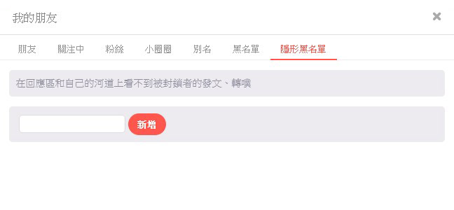
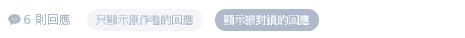

# 噗浪隱形黑名單

隱形封鎖使用者

## 功能

* 使用者在回應區和自己的河道上將看不到被封鎖者的發文、轉噗。
* 被封鎖方還是看的到使用者，所有功能都正常，~~頂多會覺得自己正被放置~~。

## 安裝腳本

*必須先在瀏覽器安裝腳本管理工具，例如 [Tampermonkey](https://www.tampermonkey.net/)。*

前往 [plurk_shadow_block.user.js](./plurk_shadow_block.user.js) 並開啟原始碼（按下程式碼上方的 Raw 按鈕），腳本管理工具會自動詢問是否進行安裝；或是可以複製程式後自行在腳本管理工具中新增腳本。

## 使用方式

### 加入黑名單

開啟 *我的朋友*，在 *隱形黑名單* 分頁上方輸入的某人的帳號並新增。

### 移除黑名單

在隱形黑名單中點選移除按鈕。

### 在回應中暫時顯示被隱藏的回應

按下 *顯示被封鎖的回應* 即可顯示被隱藏的回應。

## 注意事項

* 此黑名單無法跨裝置生效。
